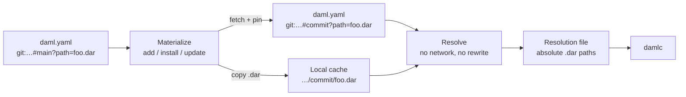

# Technical design

Git is a **second remote source** for prebuilt DAR dependencies, next to OCI. A project can point at a file in a repository or an asset on a GitHub release. `dpm` fetches it and **pins it so later builds use the same bytes**. How to write those lines is on [Declaring Git dependencies]({{ '/git-references.html' | relative_url }}). How to try them is on [Testing with a demo project]({{ '/testing.html' | relative_url }}).

## Background

`dpm` already treats remote DARs as first-class dependencies. The existing remote source is OCI. Teams also publish prebuilt DAR files in Git: a path inside a repository, or an asset on a GitHub release.

`damlc` does not speak Git or OCI. **It compiles from local files.** If a project lists a remote location in `daml.yaml`, something in front of the compiler must:

1. turn that location into a file on disk; and
2. hand the compiler only those local paths.

That frontend is `dpm`. Git support **reuses the same lifecycle OCI already uses** (`add`, `install`, `update`, `resolve`) rather than inventing a Git-only workflow.

## Non-goals

This feature fetches a **prebuilt** DAR file. It **does not clone a Daml project and build it**. If the file is missing, empty, or not a DAR at the chosen revision, install fails with that fact. The author of the dependency is responsible for committing or releasing the artifact.

`damlc` **does not learn the `git:` syntax**. The compiler keeps a single input shape: absolute paths in a resolution file written by `dpm`.

## Materialize and resolve

Two different jobs share `daml.yaml`. **Mixing them is what makes builds non-reproducible.**

***Materialize*** (`dpm add`, `dpm install`, `dpm update`) **may use the network**. It fetches bytes, writes the cache, and may rewrite `daml.yaml` so a moving name becomes a fixed identity.

***Resolve*** (`dpm resolve`, and the same lookup `dpm` does before it starts `damlc`) **must not use the network and must not rewrite the project**. It only answers one question: given what is declared and what is already in the cache, which local files should the compiler see?

That split already exists for OCI. Git follows it on purpose:

- **A branch name is not a build input.** The commit it pointed at on the last install is.
- A cold machine that has never run `install` **must fail `resolve`** with a message that says "run install". It must not silently clone `main` as it exists today.
- A warm machine with a populated cache **must be able to resolve and compile offline**.

**If resolve fetched**, two checkouts of the same unpinned `#main` could compile different bytes, and every `dpm build` would depend on Git being reachable.

The following figure shows **which commands are allowed to talk to Git**. Resolve is a lookup.

`damlc` never appears on the left. **It only consumes the resolution file.** A missing pin or a missing cache file stops at resolve and tells the operator to materialize. It does not clone as a side effect of asking "what should we compile?"

## Design decisions

- Use single-line format only
- Pin in the field the author used
- Use HTTPS Git only
- Keep the two `daml.yaml` fields

## Materialize phase

Materialize **turns a name into bytes plus a fixed name**. It runs the following steps in order.

### Prepare the project file

`dpm` walks both fields.

- `dpm` replaces an *umbrella* `?release=` line, one with no asset, with **one line per `.dar` asset** on that release. Wrapper entries that carry a main package id keep that wrapper. Assets already listed are not duplicated.
- If listing the release fails, **the project file is left as it was**. On `add` of a new umbrella line, the temporary line is removed. If listing succeeds and a later download fails, the per-asset lines stay, so a retry does not list the release again.
- `dpm` **writes the canonical form**. Aliases become full `git:` URIs. Recognized pasted URLs become the one-line form.

### Fetch missing artifacts

For a **repository file**:

- If the revision is already a full commit and a non-empty cached DAR file exists at the expected path, **nothing is cloned**.
- Otherwise `dpm` reuses or creates a working clone of that repository, one clone per `host/org/repo`, kept next to the cache. It fetches the requested revision, checks out the commit that revision currently names, and **copies the DAR file out of the worktree**.
- The copy is **atomic**. The source must be a regular, non-empty `.dar` file. A symlink that leaves the worktree is **rejected**. An empty file in the repository is an **error**, because the publisher did not ship an artifact. An empty file already in the cache is treated as not cached and fetched again.

For a **release asset**:

- If the cached file is present and non-empty, it is reused.
- Otherwise the named asset is **downloaded from the GitHub Releases API** into the cache.

### Pin branches and tags

After a successful repository fetch, if the declared revision was a branch or tag, `dpm` **rewrites that list entry to the commit that was just checked out**. Already-pinned commits are **not re-resolved**. `update` only fetches them when the cache file is missing. Release tags are **not rewritten**.

`dpm update --check` is the **read-only counterpart**. It succeeds when every repository Git DAR is commit-pinned and cached, and every release asset is cached. It fails on a moving ref, a missing cache file, or an umbrella release that was never expanded. It does not fetch and does not edit `daml.yaml`.

## Resolve phase

Resolve is a **cache lookup** driven by the *already-pinned* project file.

1. Read `daml.yaml`. **Do not clone, do not call GitHub, do not edit the file.**
2. Walk `dependencies`, then `data-dependencies`.
3. For each Git repository-file line:
   - if the revision is not a 40-character commit, **fail**: the project is not installed, and a branch name is not enough;
   - if the cache does not contain a non-empty file for `(repository, commit, path)`, **fail**: install (or update) has not materialized it;
   - otherwise emit that file's absolute path.
4. For each Git release line:
   - if there is no asset (still an umbrella), **fail**: expand first by running install or update;
   - if the cache file for `(repository, tag, asset)` is missing or empty, **fail**;
   - otherwise emit that absolute path.
5. Write those paths into the resolution document, in the matching resolved list. `dpm` then starts `damlc` with that document. **The compiler never sees a `git:` string.**

That is the whole resolution implementation: **parse the declaration, demand a pin, demand a cache hit, return a path**. The network, clone, and rewrite work already happened in materialize.

## Cache layout

The cache is content-addressed enough that **two projects asking for the same artifact share one file**.

- Repository file: `…/cache/git/<host>/<org>/<repo>/<commit>/<path/in/repo.dar>`  
  **The commit is the identity.** `#main` never appears in this path after a successful install.
- Release asset: `…/cache/git/<host>/<org>/<repo>/<hash-of-tag-and-asset>/<asset>`  
  The tag is not a commit, so the directory name is a **hash of tag plus asset name**. This keeps two assets on the same release from colliding and keeps the path free of raw tag characters.

Path segments are **sanitized** so a hostile repository name or `..` in a path cannot write outside the cache root.

The working clone (`…/<repo>/.work/…`) is an implementation detail of fetch. **Resolve never looks at it.** Only the copied DAR file under the commit (or release hash) is a resolve input.

## Install compared with update

`install` **makes the current declaration real**. If the line already says a commit and the file is cached, it is a no-op.

`update` **re-evaluates names that are allowed to move**:

- a branch or tag is fetched again and the pin is overwritten if the commit changed;
- a commit pin is left alone, and fetched only to fill a missing cache;
- a release tag is left alone (after any missing umbrella expansion).

That matches OCI. Floating tags are refreshed on update. Digest pins are not.

## Lockfile

When the existing lockfile switch is on, Git DARs in `dependencies` participate with a **stable identity key** (repository plus path, or release plus asset) the same way OCI DARs do. The lockfile still does **not** record `data-dependencies`. That is why **pinning in `daml.yaml` is the reproducibility mechanism** that covers both fields.

## Error handling

Materialize **fails closed**: unknown host for releases, SSH, mixed shapes, missing path, missing file at that revision, empty source DAR file, symlink escape, unknown release or asset.

Resolve **fails closed**: unpinned ref, missing or empty cache, unexpanded umbrella release. The error tells the operator to install or update. **It does not repair the project** as a side effect of asking "what should we compile?"

## Compiler integration

From the point of view of `damlc`, **nothing Git-specific happened**. It receives the same kind of resolution document it already receives for OCI and for local paths: two lists of absolute `.dar` files. Git is a **new way for `dpm` to fill those lists**, not a new compiler feature.
